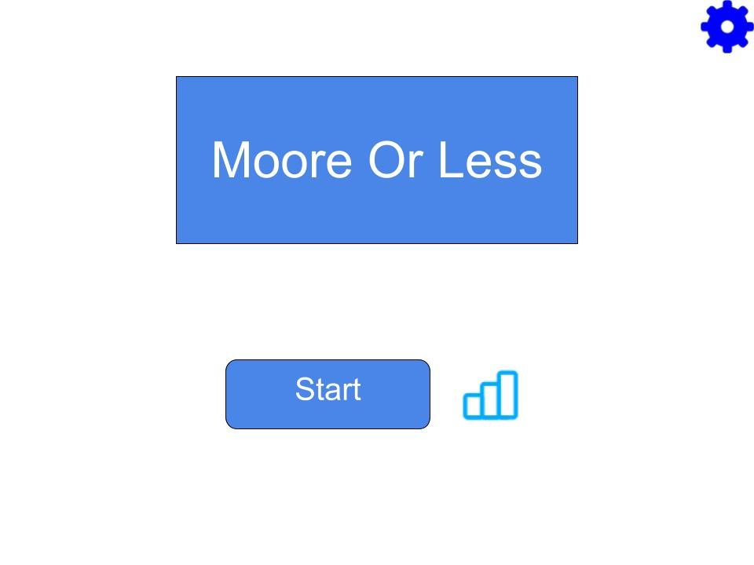
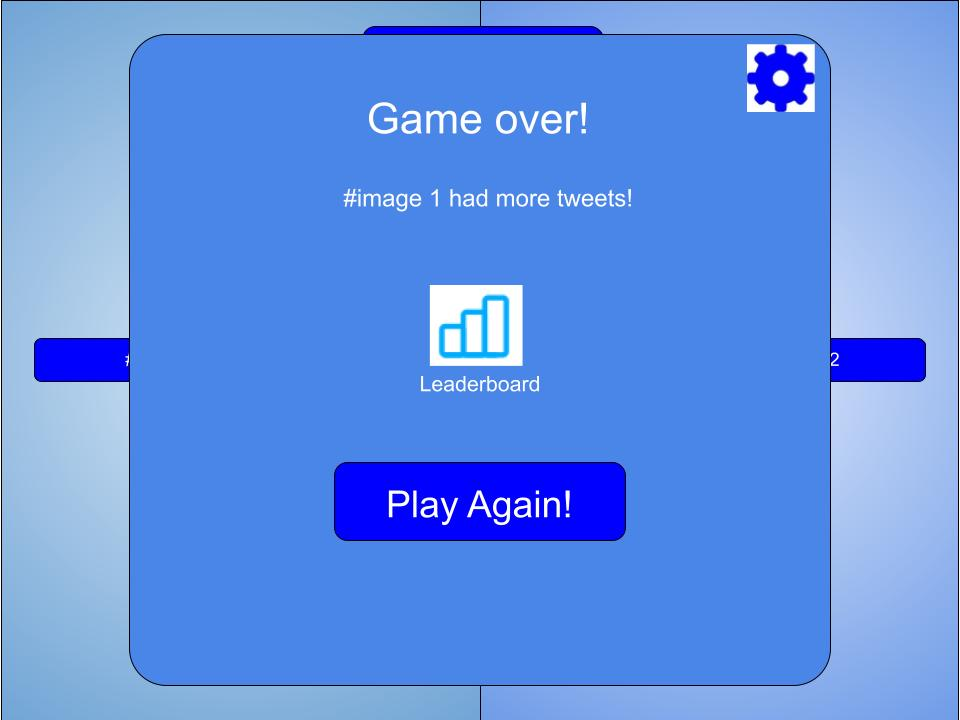
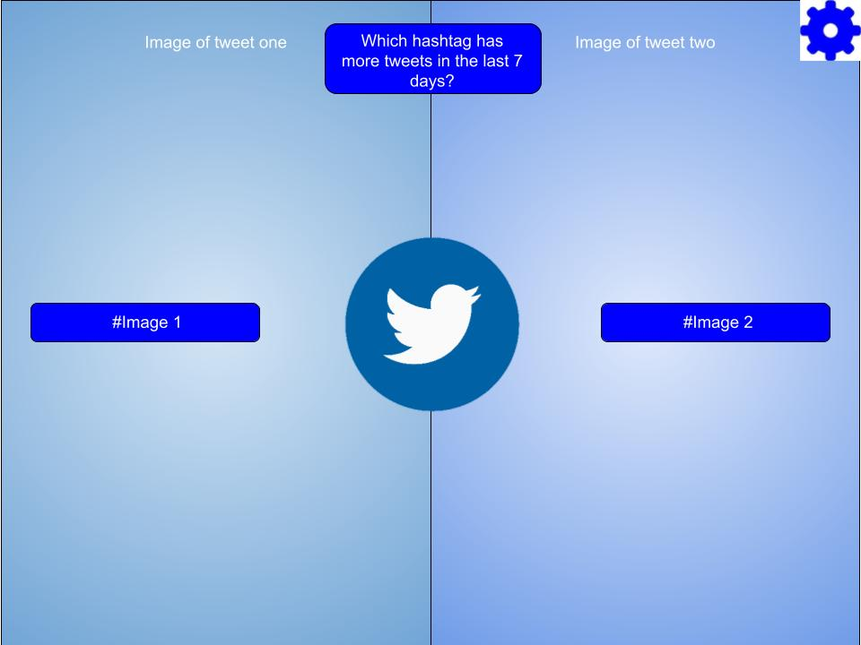
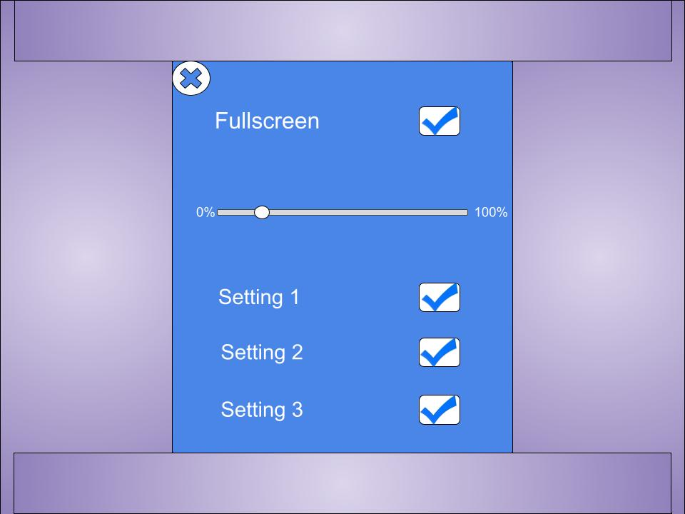

:warning: Everything between << >> needs to be replaced (remove << >> after replacing)
# CS110 Project Proposal
# Moore or Less
## CS 110 Final Project
### Fall, 2021
### [Assignment Description](https://docs.google.com/document/d/1H4R6yLL7som1lglyXWZ04RvTp_RvRFCCBn6sqv-82ps/edit#)

<< [https://github.com/<repo>](#) >>

<< [link to demo presentation slides](#) >>

### Team: Moore or less
#### Senih Okuyucu, Sharan Saha, Clayton Battle

***

## Project Description *(Software Lead)*
our project is a trend guessing game, where a random hashtag from twitter is shown. This hastag, called the Base Trend (BT), is shown along with the number of tweets associated with it, which is then compared to another random hashtag, called the Comparison Trend(CT). The user has to guess whether or not the CT has more or less tweets associated with then the BT.

We will start off working with pygame and once we have work that fulfills the requirements of the project we will incorporate our work into a website and ideally an app. 

***    

## User Interface Design *(Front End Specialist)*
*Initial design concepts
	* 
	* 
	* 
	* 
	
	* Main Menu:Presents our game's title, along with buttons allowing the user to start the game, view a leaderboard, or access settings.
	* Selection:Users are presented with two tweets, and must chose which has more tweets. They may click either option, or access settings. Orininally the options would have photos, but some trending twitter topics are controversial so this idea was scrapped.
	* Game Over: Users are shown which tweet had more tweets, and have the options to play again, view the leaderboard, or access settings.
	* Settings:Users have the ability to make the game full screen, or change other game settings. This menu was later scrapped and integrated with the main menu.

* << You should also have a screenshot of each screen for your final GUI >>

***        

## Program Design *(Backend Specialist)*
* Non-Standard libraries
    * << You should have a list of any additional libraries or modules used (pygame, request) beyond non-standard python. >>
    * For each additional module you should include
        * url for the module documentation
        * a short description of the module
* Class Interface Design
    * << A simple drawing that shows the class relationships in your code (see below for an example). >>
        * 
    * This does not need to be overly detailed, but should show how your code fits into the Model/View/Controller paradigm.
* Classes
    * << You should have a list of each of your classes with a description. >>

## Project Structure *(Software Lead)*

The Project is broken down into the following file structure:
* main.py
* bin
    * apiCall.py
    * apiCodes.py
    * tweepy
    * Codes.Zip
    * trends.txt
* assets
    * <all of your media, i.e. images, font files, etc,  gshouldo here)
    * MainMenu.jpg
    * Settings.jpg
    * general_structure.jpg
    * Selection.jpg
    * GameOver.jpg
* etc
    * <This is a catch all folder for things that are not part of your project, but you want to keep with your project. Your demo video should go here.>

***

## Tasks and Responsibilities *(Software Lead)*
* You must outline the team member roles and who was responsible for each class/method, both individual and collaborative.

### Software Lead - Senih O

<< Worked as integration specialist by... >>

### Front End Specialist - Clay B

Front-end lead conducted significant research on making GUIs in pygame and the pygame-menus library. We wanted to ensure the menus we created were high quality and functional, so Clay researched a libarary to help us with this. In addition, Clay wrote the GUI portions of our controller class, coded our menus, and was responsible for placing our models on screen.

### Back End Specialist - Sharan S

<< The back end specialist... >>

## Testing *(Software Lead)*
* << Describe your testing strategy for your project. >>
    * << Example >>

* Your ATP

| Step                  | Procedure     | Expected Results  | Actual Results |
| ----------------------|:-------------:| -----------------:| -------------- |
|  1  | Open terminal, navigate to folder, and type, “python3 main.py" | More or Less starts and shows the Main Menu GUI |          |
|  2  | Enter username  | Username updates to the user input |                 |
|  3  | Play game by clicking "Play" with mouse |  runs apiCall.py file which updates the trends.json, starts GameLoop and transitions to game GUI, showing a base trend with a tweet count and a comparison trend, both pulled from the trends.json file|     |
|  4  | User presses the correct button in game GUI|returns new comparison trend and makes current comparison trend into base trend|     |
|  5  | User presses the incorect button in game GUI| ends game and shows the end game GUI|       |
|  6  | click on the "Leaderboard" option in the Game Over menu" | GUI transitions to leaderboard, shows top ten high scores |       |
|  7  | click "Main Menu" in the Leaderboard GUI | Transitions to the Main Menu GUI again |       |
|  8  | click "theme" in the Main Menu | toggles between Light Mode and Dark Mode |       |
|  9  | click "quit" in the Main Menu | exits program |     |
etc...
