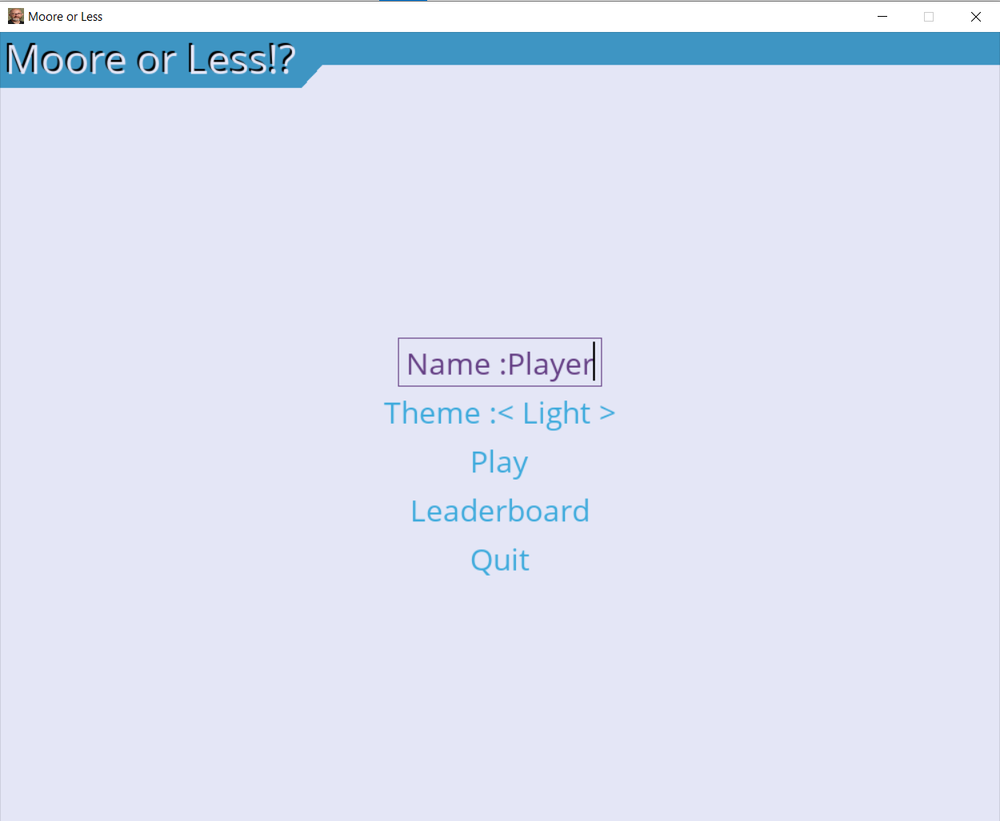
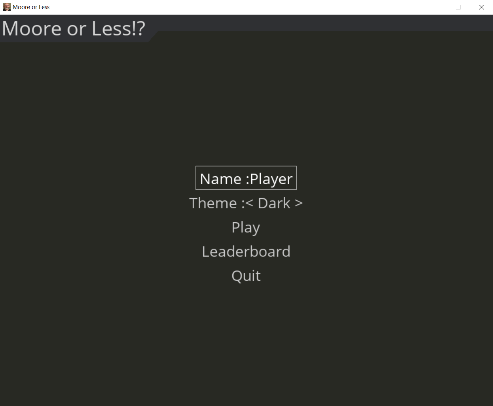
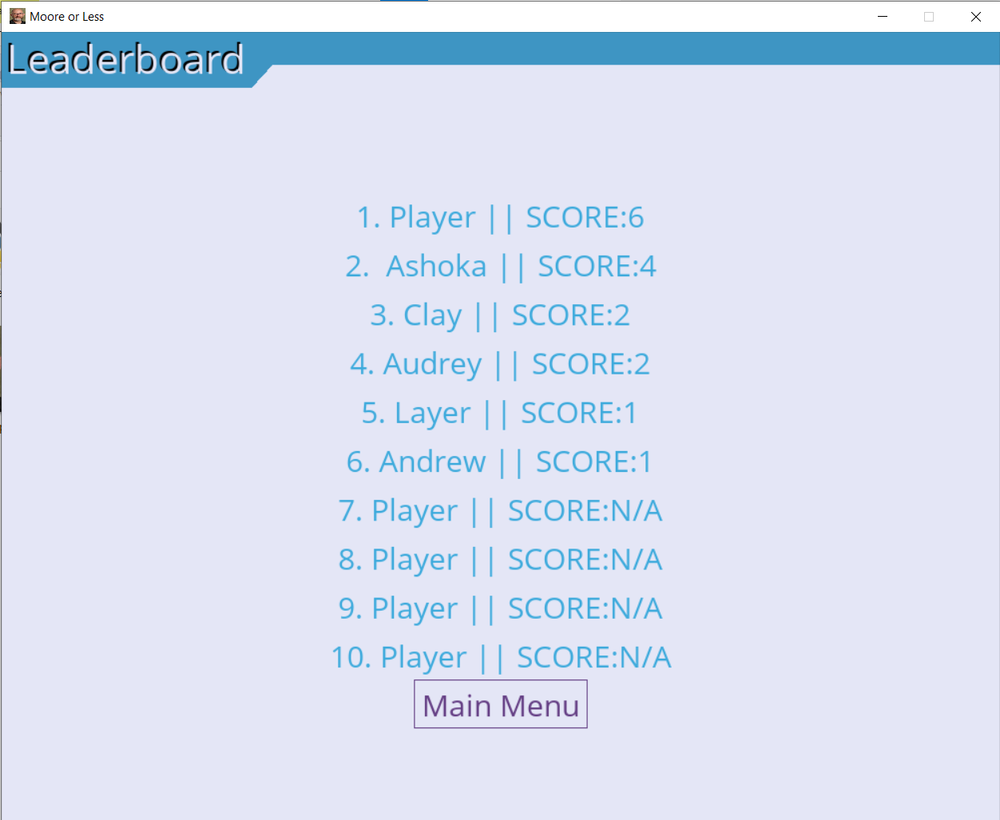
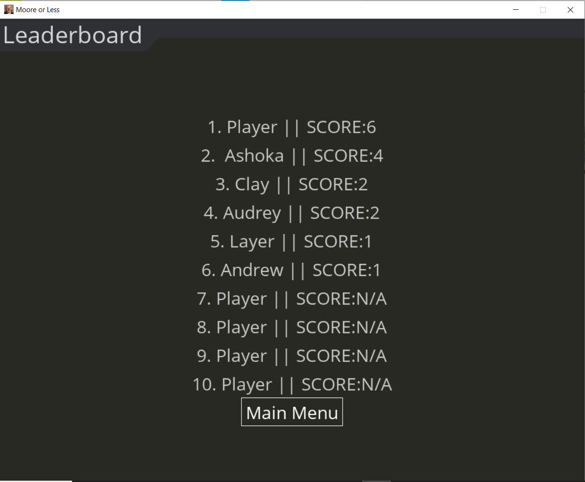
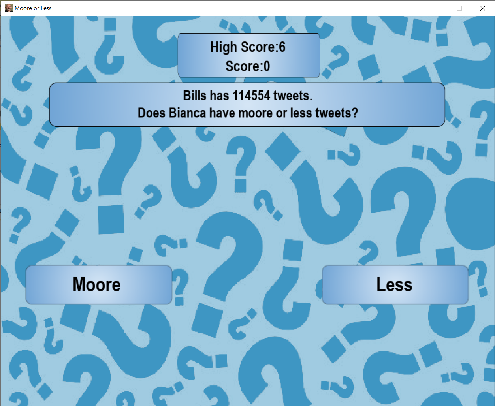
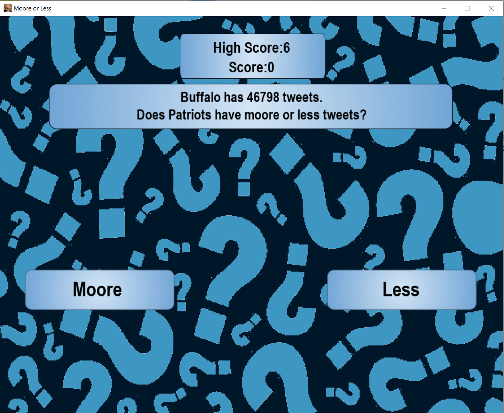
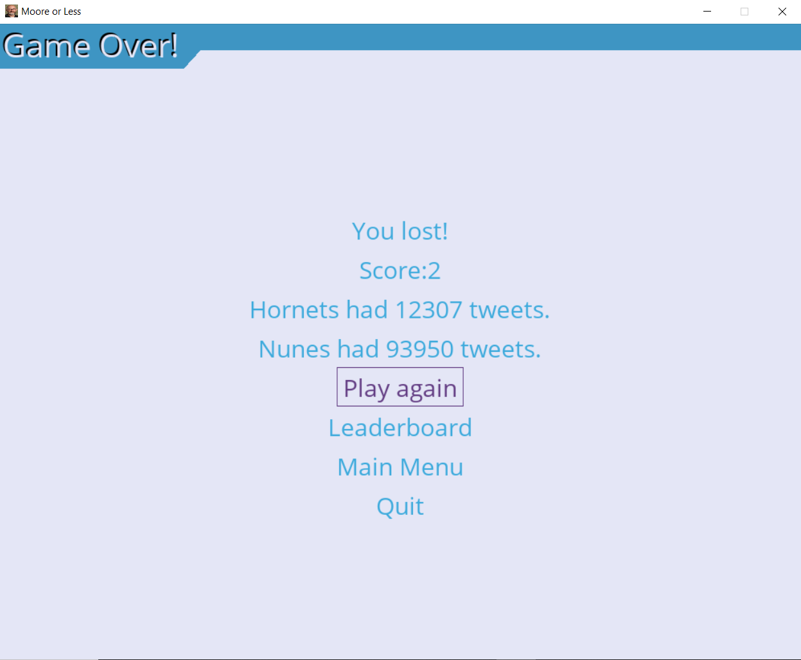
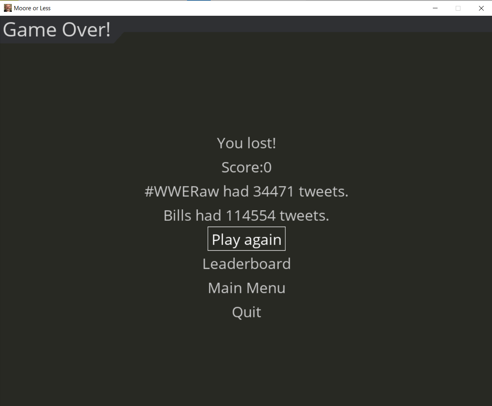

:warning: Everything between << >> needs to be replaced (remove << >> after replacing)
# CS110 Project Proposal
# Moore or Less
## CS 110 Final Project
### Fall, 2021
### [Assignment Description](https://docs.google.com/document/d/1H4R6yLL7som1lglyXWZ04RvTp_RvRFCCBn6sqv-82ps/edit#)

<< [https://github.com/<repo>](#) >>

<< [link to demo presentation slides](#) >>

### Team: Moore or less
#### Senih Okuyucu, Sharan Saha, Clayton Battle

***

## Project Description 
Our project is a trend guessing game, where a random trend from twitter is shown. The trends are pulled from twitter using Tweepy, a python based twitter API library. Trends pulled from twitter are then put into a shuffled deck, from which one trend is chosen. This trend, called the Base Trend (BT), is shown along with the number of tweets associated with it, which is then compared to another random trend, called the Comparison Trend(CT). The user has to guess whether or not the CT has more or less tweets than the BT. Upon a successful guess, a point is added to the user's score, and if the player has passed the high score for their corresponding name, the high score is updated as well. The objective of the game is to obtain the highest score possible. The game ends when the user makes an incorrect guess on what trend has more tweets. Upon losing, the user is presnted with their score, and the number of tweets the CT and BT had. The user's score is then updated to the leaderboard. 

We will start off working with pygame and once we have work that fulfills the requirements of the project we will incorporate our work into a website and ideally an app. 

***    

## User Interface Design 
* Initial GUI concepts
	* 
	* 
	* 
	* 
	
* Final GUI 
	* 
	* 
	* 
	* 
	* 
	* 
	* 
	* 

	* Main Menu:Presents our game's title, along with buttons allowing the user to start the game, view a leaderboard, or access settings. In the final version, the settings button is replaced with a simple light/dark mode switch, as it's the only user setting.
	* Selection:Users are presented with two tweets, and must chose which has more tweets. They may click either option, or access settings. Orininally the options would have photos, but some trending twitter topics are controversial so this idea was scrapped.
	* Game Over:Users are shown tweet counts for both trends, and have the options to play again, view the leaderboard, or access settings.
	* Leaderboard:Users are presented a list of up to ten other players with their highest scores to see where they rank in comparison to others. If there are less than ten players in the user info, then there are filler posistions displayed where the player name is "Player" and the Score is N/A.
	* Settings:Users have the ability to make the game full screen, or change other game settings. This menu was later scrapped and integrated with the main menu.

***        

## Program Design 
* Non-Standard libraries
    * pygame 
        * https://www.pygame.org/ 
        * Module set incorporating many common game development functions into python. Handles all the graphical elements in our code
    * Tweepy 
        * https://www.tweepy.org/
        * Easy to use python library for accessing the Twitter API. Returns raw data for real time trending topics in the Twitter app. 
    * Pygame Menus
        * https://pypi.org/project/pygame-menu/
        * Library for creating menus and GUIS. Gives people the ability to add visuals to their code. 
        
    
    *
* Class Interface Design
    * 
    * This does not need to be overly detailed, but should show how your code fits into the Model/View/Controller paradigm.
* Classes
    * apiCall
    * button 
    * label
    * Controller

## Project Structure 

The Project is broken down into the following file structure:
* main.py
* src
    * apiCall.py
    * apiCodes.py
    * Codes.Zip
    * trends.txt
    * ProjectVenv
    * controller.py
    * label.py
    * trends.json
    * userinfo.json
* assets
    * <all of your media, i.e. images, font files, etc,  gshouldo here)
    * MainMenu.jpg
    * Settings.jpg
    * general_structure.jpg
    * Selection.jpg
    * GameOver.jpg
    * Button.png
    * samoore.jpg
    * Label.png
    * SmallLabel.png
    * Dark_Background.png
    * DarkLeaderboardFinal.png
    * DarkGameOverFinal.png
    * DarkMainMenuFinal.png
    * DarkSelectionFinal.png
    * Light_Background.png
    * LightGameOverFinal.png
    * LightLeaderboardFinal.png
    * LightMainMenuFinal.png
    * LightSelectionFinal.png

***

## Tasks and Responsibilities 

### Software Lead - Senih O

Senih spent a lot of the early stages of the project researching and attmepting to get a working twitter API. This was accomplished by extensive research on the Tweepy Library and it's interaction with twitters API. Once that was done, most of his work was primarily focused on overseeing the vision and execution of the program's mechanics and GUI, along with integrating the back-end classes and data with the GUI on the front end.

### Front End Specialist - Clay B

Clay lead conducted significant research on making GUIs in pygame and the pygame-menus library. We wanted to ensure the menus we created were high quality and functional, so Clay researched a libarary to help us with this. In addition, Clay wrote the GUI portions of our controller class, coded our menus, and was responsible for placing our models on screen.

### Back End Specialist - Sharan S

Sharan was responsible for taking raw data from API and formatting it to work with rest of program. The base trends and comparison trends are random items from the list in trends.json, and if they were the same, the comparison trend would be a different trend. Back end also had to make sure the userinfo.json file would be updated if a new player is added or if there is a new high score is reached. 

## Testing 

| Step                  | Procedure     | Expected Results  | Actual Results |
| ----------------------|:-------------:| -----------------:| -------------- |
|  1  | Open terminal, navigate to folder, and type, “python3 main.py" | More or Less starts and shows the Main Menu GUI |          |
|  2  | Enter username  | Username updates to the user input |                 |
|  3  | Play game by clicking "Play" with mouse |  runs apiCall.py file which updates the trends.json, starts GameLoop and transitions to game GUI, showing a base trend with a tweet count and a comparison trend, both pulled from the trends.json file|     |
|  4  | User presses the correct button in game GUI|returns new comparison trend and makes current comparison trend into base trend|     |
|  5  | User presses the incorect button in game GUI| ends game and shows the end game GUI|       |
|  6  | click on the "Leaderboard" option in the Game Over menu" | GUI transitions to leaderboard, shows top ten high scores |       |
|  7  | click "Main Menu" in the Leaderboard GUI | Transitions to the Main Menu GUI again |       |
|  8  | click "theme" in the Main Menu | toggles between Light Mode and Dark Mode |       |
|  9  | click "quit" in the Main Menu | exits program |     |
